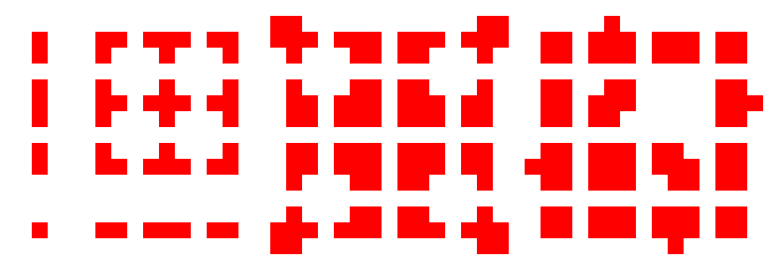
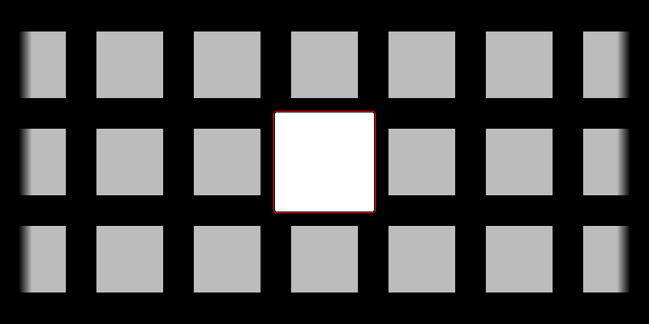
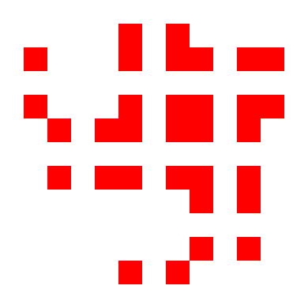
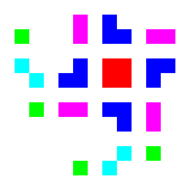
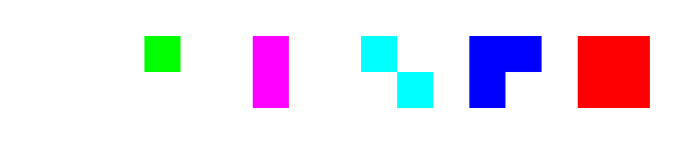
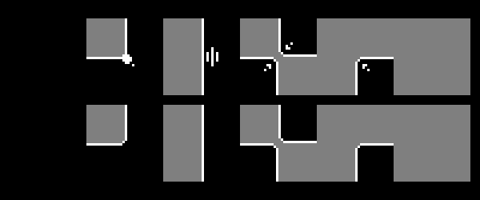
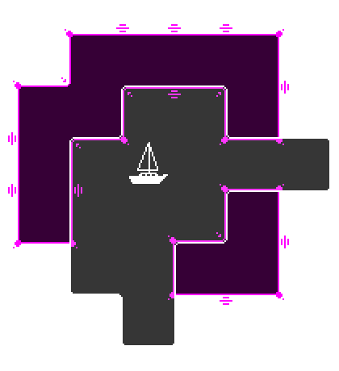

# Idea

After watching [this video by jess::codes](https://www.youtube.com/watch?v=jEWFSv3ivTg) and [Oskar Stålberg's talk](https://www.youtube.com/watch?v=Uxeo9c-PX-w&t=308s) about dual grid system, I was inspired to apply this concept in Godot using even fewer tiles. By relying on transformations in code, we can reduce the number of tiles needed to cover all configurations of a square grid to just six (!), assuming, of course, that the desired effect is fully 2D.


3x3 minimal tileset

For full coverage of a classic square grid, where each cell has eight neighbors, you would need 2<sup>8</sup> (256) tiles. However, you can reduce this number to a more manageable 48 by assuming the center tile will always be present and that a corner can only exist if its two nearest edges are present. This reduction results in the commonly used 3x3 minimal tileset.

# Dual Grid System

## How it works?

You can further reduce the number of tiles needed by using a dual grid system. Shifting the offset grid by half a tile reduces the number of neighbors to consider to just four. This results in 2424 (16) possible combinations. Some people could see that operation as creating a [Dual graph](https://en.wikipedia.org/wiki/Dual_graph), but I don't really do math.


Shifting the grid

## What problems does it solve?

Now, with just 16 tiles, you can replicate the effect that previously required 48 tiles using the standard approach. Since tile boundaries lie in the middle of the tiles, you can create consistent inner and outer corners.


2x2 tileset

For a more in-depth look into tilemaps and the dual grid system, please refer to the resources at the bottom of the page.

# Additional transformations


2x2 tileset (colored)

The keen-eyed among you might have noticed some repetition in the 2x2 tileset. If we allow our Godot component to access certain tiles by flipping and transposing them, the number of unique tiles drops to just six.


Final 6 tiles

By making this decision, we, of course, sacrifice the ability to create distinct tiles for the left and right walls, for example. However, for simple highlighting of grid sections, having that level of control is unnecessary. The reduced number of tiles also makes it faster to swap textures for other applications.

# Godot scene

I used a TileMap layer as the base of my scene, primarily to access all the TileMap layer methods and reduce node tree depth. I named this component OffsetGrid. It takes in the tile size (in pixels) and an array of Vector2i values representing all the filled cells in the coordinate system of the main grid. The tile size is used to calculate and apply the offset.

```gdscript
var flip_h := TileSetAtlasSource.TRANSFORM_FLIP_H
var flip_v := TileSetAtlasSource.TRANSFORM_FLIP_V
var transpose := TileSetAtlasSource.TRANSFORM_TRANSPOSE

var tile_array = [
	[Vector2i(0,0), 0],
	[Vector2i(1,0), flip_v + flip_h],
	[Vector2i(1,0), flip_v],
	[Vector2i(2,0), flip_v + transpose],
	[Vector2i(1,0), flip_h],
	[Vector2i(2,0), flip_h],
	[Vector2i(3,0), flip_h],
	[Vector2i(4,0), flip_v + flip_h],
	[Vector2i(1,0), 0],
	[Vector2i(3,0), 0],
	[Vector2i(2,0), 0],
	[Vector2i(4,0), flip_v],
	[Vector2i(2,0), transpose],
	[Vector2i(4,0), flip_h],
	[Vector2i(4,0), 0],
	[Vector2i(5,0), 0]
]
```

For each possible neighbor configuration, there is a unique set of Tile Atlas coordinates and transformations to apply. I created this by using each position in an array as a four-digit binary flag set for the neighboring cells.

```gdscript
func set_offset_layer_cell(offset_cell: Vector2i, neighbour_matrix: int):
	var dict_value = tile_array[neighbour_matrix]
	var current_tile_atlas_coords: Vector2i = dict_value[0]
	var transforms: int = dict_value[1]
	set_cell(offset_cell, 0, current_tile_atlas_coords, transforms)
```

See the full code on my [GitHub](https://github.com/kabaczek1/kaba-game/blob/main/game_scenes/elements/offset_grid/offset_grid.gd).

# Effect


Two tileset textures for obstacle and range layers


Two components in action

Two instances of the "OffsetGrid" Godot scene, each with different textures: the gray OffsetGrid shows the unit's range of movement, while the violet OffsetGrid represents obstacles on the map. The violet color is achieved by changing the "modulate" value in that instance of OffsetGrid component.

# Advantages

- Changing the texture is fast, making iteration easy.
- Consistent rounded inner and outer corners can be achieved.
- A minimal number of tiles are needed to draw.

# Drawbacks

- No control over tile appearance based on position (the left edge will be a mirrored version of the right).
- To change the texture, you need to adjust elements deeper in the inspector than I would prefer.
- Only useful in specific circumstances, such as fully 2D overlays.

# Summary

When I started, I wanted to create a component that could later be reused in many situations where highlighting an area on the grid was required. I believe I achieved that goal. The component is a little more cumbersome to use because the texture is deep in the inspector, but I'm happy with it nonetheless.

# References

- ["Draw fewer tiles - by using a Dual-Grid system!" by jess::codes](https://www.youtube.com/watch?v=jEWFSv3ivTg)
- ["SGC21- Oskar Stålberg - Beyond Townscapers" by Oskar Stålberg](https://www.youtube.com/watch?v=Uxeo9c-PX-w&t=308s)
- ["Autotiling in Godot 3.0" by michagamedev](https://michagamedev.wordpress.com/2018/02/24/181/)
