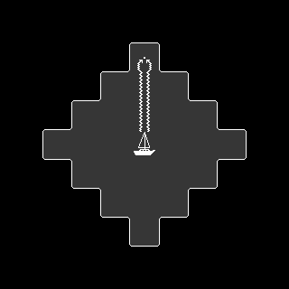

# Idea

After creating a [component that allows highlighting an area on a grid](/posts/dual-grid-tilemap), I thought about using fewer tiles and relying on transformations for other components. The first that came to mind was a path drawing component. In grid-based strategy games showing a path that a unit can take is pretty common.

Changing the texture easily, based on type of movement or type of unit might be useful. I plan to use only four neighbors per grid cell. This means eliminating diagonal movement, but it also means fewer tiles.

I designed this component with exactly four tiles in mind: **ORIGIN**, **STRAIGHT**, **TURN** and **TARGET**.


Gridpath texture

# Plan

Firstly, I needed to establish some design requirements.

1. Use [dependency injection](https://en.wikipedia.org/wiki/Dependency_injection) for the main grid, as this component might be used in different settings, such as a world map or a battle map.
2. Ensure compatibility with Godot’s [`AStarGrid2D`](https://docs.godotengine.org/en/stable/classes/class_astargrid2d.html) implementation.
3. Make it as easy to use as possible.

# Godot scene

As a base node, I chose `Node2D`. Component exports two variables: `tile_map` - grid it will reference, and `texture` with four tiles.

To draw a path, programmer needs to assign a value to `cells_array`, which takes the output from `AStarGrid2D` and then draws resulting path calling `draw_path` function, provided it is valid.

Component also keeps track of `steps_array`, which will be helpful in a process of determining each of the tiles.

```gdscript
extends Node2D

class_name GridPath

@export var tile_map: TileMapLayer
@export var texture: AtlasTexture

var cells_array: Array[Vector2i]:
	set(value):
		cells_array = value
		if cells_array.size() >= 2:
			draw_path()

var steps_array: Array[int] # 0 - up, 1 - right, 2 - down, 3 - left
```

Drawing path stored in `cells_array` as an array of `Vector2i` variables is handled by `draw_path` function. In the first step, it removes all current children, then calls `create_steps_array` and `spawn_path_elements` in sequence.

To create steps array, the program clears `steps_array`, then loops through `cells_array` and determines the value for each step by comparing grid coordinates of current and next cells.

Defining constants for each of the directions improves code readability.

```gdscript
func draw_path():
	for n in get_children():
		remove_child(n)
	create_steps_array()
	spawn_path_elements()

const UP = 0
const RIGHT = 1
const DOWN = 2
const LEFT = 3

func create_steps_array():
	steps_array.clear()
	for i in cells_array.size() - 1:
		var cell = cells_array[i]
		var next = cells_array[i + 1]
		var direction: int
		if cell.x < next.x:
			direction = RIGHT
		if cell.x > next.x:
			direction = LEFT
		if cell.y < next.y:
			direction = DOWN
		if cell.y > next.y:
			direction = UP
		steps_array.append(direction)
```

Just like when creating steps array, I defined constants for segments of the path, which makes the code more readable. The function that spawns a single path element takes the following arguments:

- `cell`: the reference grid coordinates of the cell.
- `cell_segment`: determines what part of the texture should be used.
- `cell_rotation`: the rotation of current segment in degrees.
- `flip`: a boolean value that determines `scale.y` of the element.

```gdscript
const ORIGIN_SEGMENT = 0
const STRAIGHT_SEGMENT = 1
const TURN_SEGMENT = 2
const TARGET_SEGMENT = 3

func spawn_path_element(
		cell: Vector2i,
		cell_segment: int,
		cell_rotation: int,
		flip: bool = false
	):
	var sprite2d = Sprite2D.new()
	sprite2d.texture = texture.duplicate()
	sprite2d.texture.region = Rect2(cell_segment * 32, 0, 32, 32)
	sprite2d.rotation_degrees = cell_rotation
	sprite2d.position = tile_map.grid_to_position(cell)
	if flip:
		sprite2d.scale.y = -1
	add_child(sprite2d)
```

To spawn all the elements, function first places origin element. Then, it loops through all other cells, excluding the last one, determining correct segment, rotation and if it should be flipped before spawning the element. At the end, knowing that only the last one is left, script places target segment, ensuring correct rotation.

```gdscript
func spawn_path_elements():
	spawn_path_element(
		cells_array[0],
		ORIGIN_SEGMENT,
		steps_array[0]*90
	)
	for i in range(1, cells_array.size() - 1):
		var segment
		if steps_array[i - 1] == steps_array[i]:
			segment = STRAIGHT_SEGMENT
		else:
			segment = TURN_SEGMENT
		var segment_rotation
		if segment == STRAIGHT_SEGMENT:
			segment_rotation = steps_array[i]*90
		else: #TURN_SEGMENT
			segment_rotation = steps_array[i]*90 - 90
		var segment_flip = false
		if steps_array[i - 1] == RIGHT and steps_array[i] == UP:
			segment_flip = true
		if steps_array[i - 1] == LEFT and steps_array[i] == DOWN:
			segment_flip = true
		if steps_array[i - 1] == DOWN and steps_array[i] == RIGHT:
			segment_flip = true
		if steps_array[i - 1] == UP and steps_array[i] == LEFT:
			segment_flip = true
		spawn_path_element(
			cells_array[i],
			segment,
			segment_rotation,
			segment_flip
		)
	spawn_path_element(
		cells_array[-1],
		TARGET_SEGMENT,
		steps_array[-1]*90
	)
```

# Effect

The `GridPath` component is easy to use and modify by simply changing the texture.


Gridpath texture


Using the `GridPath` component to show torpedo attack path.


Gridpath texture



# Summary

I am happy with the component, I believe that all the design requirement outlined at the start of the process have been achieved. Possible improvements include:

- Inferring tilesize from the reference grid.
- Keeping the rotation as an abstract value and determining it in the `spawn_path_element` function.
- Determining `segment_flip` value only if the segment is a turn segment.
