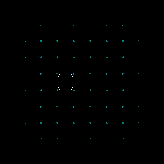
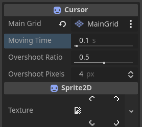
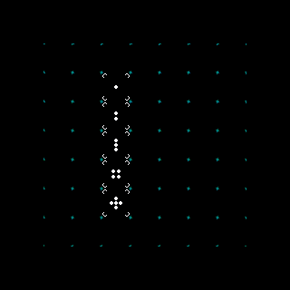
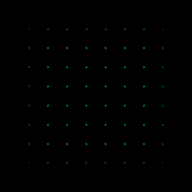
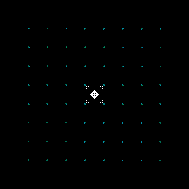

# Idea

I knew I wanted satisfying snapping cursor for my grid-based game. But what makes a cursor really satisfying? I could, of course, try to do some research in that direction, but that is much less fun than tinkering with code.

# Plan

What do I want my cursor component to do?

- Follow mouse movements - it is a cursor, after all.
- Snap to grid cell when the mouse eneters one.
- Stay put when the mouse moves inside the cell.
- Animate movement - some snapping action.
- Allow fine-tuning of movement animation aspects.
- Enable easy changes to the cursor texture.

# Godot scene

To create the component, I chose `Sprite2D` as the base node. This allows the cursor component to have its texture easily available in the inspector. It also requires a reference to the main grid. I used export variable to loosely couple the components.

I separated the snapping animation into two phases:

- **Overshoot phase** - The cursor moves slightly beyond the target position.
- **Correction phase** - The cursor adjusts back to the target position.


The cursor snaps between two cells to demonstrate the animation phases

To achieve control over these, I created three parameters:

- `overshoot_pixels` - An integer that stores number of pixels by which to overshoot the target cell.
- `time_to_overshoot` - A float value that specifies the time (in seconds) to reach the overshoot position.
- `time_to_position` - A float value that specifies the time (in seconds) to reach the target position.

However, I didn’t really like the interface of having two separate times that needed adjusting. To simplify this, I created two additional variables:

- `moving_time` - A float representing the total movement time in seconds.
- `overshoot_ratio` - A float that specifies what proportion of the total movement time should be allocated to the overshoot phase.

These two variables are exported for the programmer to interact with. When either of them is changed, [setters](https://docs.godotengine.org/en/stable/tutorials/scripting/gdscript/gdscript_basics.html#properties-setters-and-getters) update the values of the underlying `time_to_overshoot` and `time_to_position` variables, which are then used by the component.

```gdscript
extends Sprite2D

class_name Cursor

@export var main_grid: MainGrid

@export_range(0.01, 3, 0.01, "or_greater", "suffix:s") var moving_time = 0.1:
	set(value):
		set_move_and_overshoot_times(value, overshoot_ratio)
		moving_time = value
@export_range(0.1, 0.9, 0.01) var overshoot_ratio = 0.5:
	set(value):
		set_move_and_overshoot_times(moving_time, value)
		overshoot_ratio = value
@export_range(1, 16, 1, "suffix:px") var overshoot_pixels = 4

func set_move_and_overshoot_times(new_moving_time, new_overshoot_ratio):
	time_to_overshoot = new_moving_time * new_overshoot_ratio
	time_to_position = new_moving_time - time_to_overshoot

var time_to_overshoot = 0.05
var time_to_position = 0.05
```

The component also keeps track of the last snapped position and the current cell in terms of the main grid coordinates.

Within the \_ready function, the script checks if I remembered to connect it to the main grid and alerts me if I didn’t.

```gdscript
var last_snapped_position: Vector2 = Vector2(16,16)
var current_cell: Vector2i = Vector2i(0,0)

func _ready() -> void:
	assert(main_grid != null, "set main_grid")
```

To make the component respond to mouse movements, I added the `update_position` function. It retrieves the mouse position from the input event, then uses the main grid to get the current cell and snapped position. If the new position is different from the last one, it calls the `move_cursor` function and updates the `last_snapped_position` variable.

```gdscript
func _input(event):
	if event is InputEventMouseMotion:
		update_position(event.position)

func update_position(event_position):
	current_cell = main_grid.position_to_grid(event_position)
	var new_snapped_position = main_grid.grid_to_position(current_cell)
	if last_snapped_position != new_snapped_position:
		move_cursor(new_snapped_position)
		last_snapped_position = new_snapped_position
```

The animation logic is contained within the `move_cursor` function.

Using some [vector math](https://docs.godotengine.org/en/stable/tutorials/math/vector_math.html), it figures out the direction to the overshoot position, then scales it based on the value of the overshoot_pixels variable.

Next, it creates a [Tween](https://docs.godotengine.org/en/stable/classes/class_tween.html) that will move the cursor to the overshoot position over time.

Finally, it creates another Tween to correct the overshoot.

```gdscript
func move_cursor(new_position):
	var overshoot = position - new_position
	overshoot = overshoot.normalized()
	overshoot = overshoot * overshoot_pixels

	var tween = get_tree().create_tween()
	tween.tween_property(
		$".",
		"position",
		new_position - overshoot,
		time_to_overshoot
	)
	tween.tween_property(
		$".",
		"position",
		new_position,
		time_to_position
	)
```

# Effect


Properties of the Cursor component viewed from the inspector

I created a simple scene to showcase the three adjustable parameters. For the base values, I used the following defaults:

- `overshoot_pixels = 4`
- `moving_time` - specified per demo
- `overshoot_ratio = 0.5`

For each scene, one of the parameters is changed in some way. The first scene demonstrates how changing the value of the `moving_time` variable affects the resulting motion. The values start at 1.0 for `Cursor1` and decrease by 0.2 for each following cursor, ending with a value of 0.2 for `Cursor5`.


Cursors with different speeds

The following GIF shows how the `overshoot_ratio` affects the cursors. The values start at 0.9 for `Cursor1` and decrese by 0.2 for each following cursor, ending with value of 0.1 for `Cursor5`. The value of the `moving_time` variable is set to 1.0 to make the changes more visible.


Cursors with different overshoot ratios

The final GIF demonstrates how the value of `overshoot_pixels` affects the cursors. The values start at 4 for `Cursor1` and increase by 2 for each following cursor, ending with the value of 12 for `Cursor5`. The value of the `moving_time` variable is set to 0.5 to make changes more visible.


Cursors with different values of the `overshoot_pixels` variable

The last one (for real this time), shows just some zooming around.


Cursor just zooming around

# Summary

I'm really happy with how this component turned out. Adjusting its settings and changing the texture is easy. With these parameters, I can create many different types of cursors with distinct feels for various applications. The cursor's ability to keep track of the current cell might come in handy one day.

# References

- [Godot - Properties (setters and getters)](https://docs.godotengine.org/en/stable/tutorials/scripting/gdscript/gdscript_basics.html#properties-setters-and-getters)
- [Godot - Vector math](https://docs.godotengine.org/en/stable/tutorials/math/vector_math.html)
- [Godot - GDScript exported properties](https://docs.godotengine.org/en/stable/tutorials/scripting/gdscript/gdscript_exports.html)
- [Godot - Tween](https://docs.godotengine.org/en/stable/classes/class_tween.html)


Bonus GIF 👀
