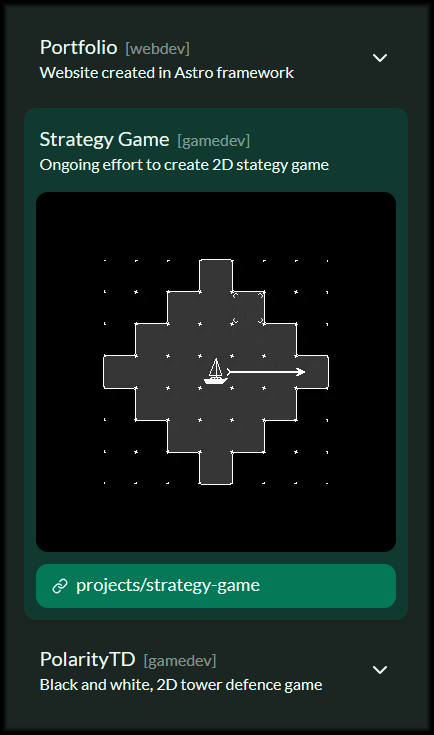

# First steps

## Target audience

When designing anything, from a microwave oven to a webpage, one of the first questions should be: "Who will be using it?" This question often proves to be more difficult than anticipated. Surely, I should design a portfolio primarily for...

### Recruiters

I want to get a job, after all [(contact 👀)](/#contact). But I discovered there are at least two more types of users who should be taken into account.

### Game developers

The blog section will gradually contain more and more content—content that might be useful for someone dealing with a similar problem. What can I do to improve their experience? I came up with a few guidelines.

First, I’ll include references to materials that were helpful to me. If someone's problem is similar to the one I faced, these references could be very valuable. Additionally, I dislike when people fail to include links to the resources they mention, so I’ll make sure to provide them.

Second, I plan to include plenty of animations showcasing how something works. These will allow readers to quickly assess whether the content is relevant to them without needing to read through a lengthy block of text.

### Me

Wait, what? I realized that considering myself as part of the target audience is the right approach. The inner workings and architecture of the webpage are just as much a subject of design as its visual aspects. Making it easy to add and update content was essential for me to continue posting regularly—the process needed to have minimal friction.

With this in mind, I chose to use GitHub Actions to deploy the site, co-locate images within Astro’s directory structure, and use Markdown for my posts. These three decisions ensure that I can add new content to the page without overthinking: I simply add some files, commit them to Git, and verify that everything works as expected.

## What to include in the portfolio?

What should I include, and what should I exclude? After hours of research, I’m still unsure—mainly because I haven’t yet decided what I want to focus my attention on. Wait... should I admit that?

## Clean look

To demonstrate to visitors that I understand good design practices, I decided on a clean and light aesthetic. My goal is to make the portfolio easy to navigate and help users quickly find relevant information. But what counts as relevant?

## Responsive design

Even though I can assume that most recruiters and game developers will access my site from a desktop, providing a good mobile experience is mandatory for any website today.

## Interaction

If I want to catch someone's attention there needs to be some interaction on the site. Hover effects, scroll effects and others show that every element of the site is intentional. Work was put into every detail.

## Steer the attention

When someone loads the site, their journey begins. My job is to make it as frictionless and engaging as possible, ensuring they find the content relevant to them. For recruiters, that would be the contact info; for fellow developers, it might be a post or project page. But how can I capture someone's focus for that long?

The homepage has just four segments, and each takes only a few seconds to explore. While I want visitors to engage with the projects and posts sections, my ultimate goal is for everyone to reach the contact section. Each project or post includes a small animation that showcases its contents. Even if someone clicks on one before reaching the end of the main page, they’ll still find my contact info waiting for them in the footer.

Footer contact info

# Project

## Domain

One of the most important decisions when creating an online presence is choosing a good domain for yourself. After considering some options, I chose "kabaczek.me".

Kabaczek means [Zucchini](https://pl.wikipedia.org/wiki/Kabaczek) in Polish. It became my nickname one day when PUBG updated and asked me to create one. I thought I could change it later—but I couldn’t. Around the same time, I joined a new group of friends and started playing with them. Before long, everyone began calling me Kabaczek.

Having a unique nickname means I already have some "brand" recognition. Nowadays, I just lean into it, which made choosing a domain much easier.

## Colors and font

Choosing colors was pretty easy. I knew I wanted the page to be in dark mode, and green is my favorite color. After half a day of experimenting, my color palette ended up so similar to the [tailwinds default emerald color palette](https://v3.tailwindcss.com/docs/customizing-colors#default-color-palette) that I decided to go with it instead.

For a font, I chose [Lato](https://www.latofonts.com/). It's a light, sans-serif font—perfect for readability.

## Components

I decided to divide my site into components.

### Menu

When I started thinking about my portfolio, I really liked the idea of having the navigation menu be full height and anchored to the left edge of the screen. It also displays the headers of the content on the page and dynamically changes the color of the current heading.

Navigation menu

### Card

Each of the featured projects or posts is represented as a card. Cards feature an expansion animation triggered by hover or click. They are designed around a 360x360 pixel animated image showcasing each entry.

Stack of card

## Sections

Page is divided into sections, each of which full height on the desktop.

### Hero

The first impression is crucial when visiting a new webpage, and because of that, I tried to polish the Hero section as much as possible. A short bio, what I do, and a call to action are all that’s needed. Sometimes, less is more.

### List

The List is used twice on the page: it displays the projects and featured posts. This section should invoke a card-like vibe. Each card contains a GIF that adds life to an otherwise simple and non-intrusive site. I want to focus the visitor’s attention on the animated image and make them curious about the next one.

### Contact

After scrolling through my projects and posts, the visitor will come across the contact section. This section contains a single card with all my contact info and a footer. Adding logos for each service makes it look more polished.

Contact card

# Technologies

## Astro

I decided to use [Astro](https://astro.build/) as my meta-framework of choice for this project. It allows for static site generation, makes it easy to add new content using markdown files, and is compatible with most of the tooling I'm familiar with and wanted to use. It has its own templating language, but it also allows the use of components from many different frameworks, such as Vue and Svelte—both of which I’ve worked with in the past.

## GitHub Pages

Deploying my site to GitHub Pages was pretty easy using [astro's guide](https://docs.astro.build/en/guides/deploy/github/). After some trial and error, the official action allowed me to add content to my page with just a few keystrokes and a Git commit. It removes friction, making it much easier to add new content.

## Tailwind

As I wanted to stick to tech that I knew, apart from Astro, I decided to use [tailwindcss](https://tailwindcss.com/). It allows me to quickly iterate on design. The [tailwindcss-typography](https://github.com/tailwindlabs/tailwindcss-typography) plugin allowed me to easily control the styling of the Astro-generated markdown pages.

# Challenges

When making new things, one often encounters new problems. Here are some challenges I encountered in the process of making this website.

## Scrolling

Each section is full-screen height, and because of that, when the page is scrolled, the content shifts. Modern browsers have algorithms that try to keep content in place, but this much movement is too much for them.

I solved this problem using a custom script that snaps the window to the correct section after the user stops resizing the window.

## Astro markdown images

One of the bigger problems was making images and captions look good on both mobile and desktop. After many attempts, I came up with a workaround that involves placing images and captions outside the paragraphs and styling paragraphs that contain images. Is it the best solution? Probably not, but it has advantages others lack. It is done, and it works.

# What's next?

There are many things I'd like to improve on this page, but as I learned the hard way during other projects, perfection is the enemy of done. Here's a list of potential improvements:

- Update the page to Astro 5.
- Add an interactive background animation to the Hero section.
- Add tag-based filtering for posts and projects.

# Summary

In the end, I'm happy with how the page turned out. It definitely has room for improvement, but using actions to build and host it will make implementing those improvements a breeze. Right now, I can't wait to start adding more content to my little corner of the web.
