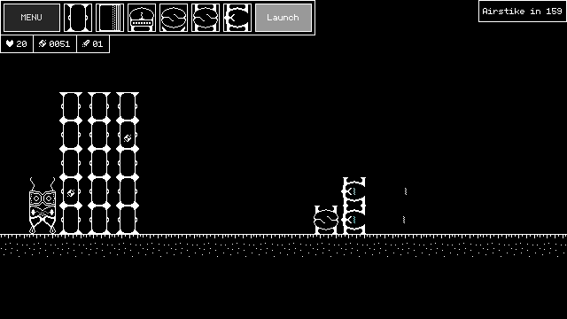

# Why was it created?

I needed to create a simple game for one of my university courses. The requirements were quite straightforward:

- The game must have a title screen and an end screen. It should start after the player takes an action and display the result until dismissed.
- The game has to be dynamic - if the player doesn't provide any input, something must still be happening on the screen. This rules out strictly turn-based games.

These requirements weren't particularly difficult to meet.

## Prototype

First version of PolarityTD

[The game](https://github.com/kabaczek1/polarity-td-prototype) was the first project that I truly finished.
I mean, it had a beginning, a middle, and an end. I have requirement number one to thank for that.
I was happy with how it turned out, even though I knew I didn’t know Godot well enough to create something without a few issues.

Well... the game had its share of issues:

- **Resolution** - Godot's default 1152×648 resolution isn’t ideal for a pixel-art game.
- **Lack of scene management** - The main menu and end screen are implemented as a CanvasLayer over the gameplay scene.
- **Lack of audio** - Audio is important but completely missing.
- **Lack of content** - The game includes only a single level, two types of enemies, and six buildings.
- **Limited options for expanding the game** - The design makes scalability difficult.

# Rewrite

After delivering the project, with all the knowledge I had, I knew I could do better.
Start from the beginning, make a comprehensive plan, and stick to it. Pretty simple.

Modularity and systems were my main focus.
If I want to do something, I want to do it well and in a way that could be used elsewere.
Using Godot’s [autoload](https://docs.godotengine.org/en/stable/tutorials/scripting/singletons_autoload.html) feature, I created the `SceneManager` - a lack of which was problematic the last time around.
With some help from a tutorial, I even added transition animations.
The first modular component was ready.

Title Screen

## Resolution

Resolution was a significant issue in the first version.
I knew I wanted to use pixel-art, and scaling can be quite problematic when working with it.
I wanted my game to look good on common display resolutions, such as 4K, 1440p, 1080p, and 720p.
Pixel-art looks best when scaled by an integer value. Because of this, my options were:

- 640×360 - This resolution can be scaled by 2 for 720p, by 3 for 1080p, and so on.
- 320×180 - Scaling would need to be larger: by 4 for 720p, by 6 for 1080p, and so on.

I quite liked the 32px tiles used in the prototype, but 320×180 doesn’t really accommodate many of them.
I decided to use 640×360 as the base viewport size for my game. I later found out that this resolution is called [nHD](https://en.wikipedia.org/wiki/Display_resolution_standards#nHD).
Using this resolution also means I can design everything to look good at that size, and in theory, it should scale well when multiplied by any integer value.
It also reminded me somewhat of portable consoles, especially the PSP (480×272).

With that knowledge, I implemented a menu for changing the game's resolution, complete with confirmation windows that revert to the previous resolution if the player doesn’t respond.

# Master's Thesis

I chose the subject of my Master’s thesis to connect it with game development. I decided to compare two game soundtracks: one created using my procedural approach and the other generated statically using a neural network-based system called GOST. However, before I could send my game out to people, I needed to finish it first.

World Map

## Solid fundation

The solid foundation that came with all the systems I created first was extremely useful. The game already had systems for displaying info, moving between scenes, pausing, choosing and keeping track of the current mission, counting points, etc., but it lacked the most important piece - the core gameplay.

Pause Menu

## Procedural Soundtrack

`MusicNode` inspector options

Based on [horizontal re-sequencing](https://en.wikipedia.org/wiki/Adaptive_music#Horizontal_re-sequencing), my approach connected every unit, building, and mission with its music node. Once every four seconds, the system chooses the next bar (based on the number and priority of entities visible on the screen) for each audio bus and plays it. Each of the 28 fragments was composed by me, but I don’t have any formal (and very little informal) training.

Audio Manager

[**Listen to how the game sounds with the procedural soundtrack.**](https://www.youtube.com/watch?v=HWnO4oM8Wmw)

## GOST

Taking my abilities into account, I was curious whether a statically generated soundtrack, created by a neural network-based system, would be rated higher than my adaptive one. Using [GOST](https://music-put.lab.dariah.pl/en/products), I created 8 pieces of music to score my game. For it to work, I needed to implement another audio system to play the files and handle crossfading between them.

GOST Manager

[**Listen to how the game sounds with the GOST soundtrack.**](https://www.youtube.com/watch?v=eRyKmjmPL58)

# Core Gameplay

PolarityTD is a strategy game. Build refineries to collect energy units and spend them on buildings to protect your base. Damage done to a building is passed up the stack to the one on top.

Starting the mission

The player faces four enemy types, each more powerful than the last.

Types of enemies

The player has access to six buildings:

- **Refinery** - Collects energy.
- **Wall** - Protects buildings behind it.
- **Shield** - Energy shield cap, protects stack of buildings.
- **Turret** - Simple turret.
- **Heavy Turret** - Shoots slower but has more powerful bolts.
- **Energy Thrower** - Powerful, but short range.

The shield and the turret act as "stack caps", preventing other buildings from being placed on top.

Types of buildings

# Takeaways

Making PolarityTD was my first experience creating a game from start to finish. The process taught me a lot about game development and expanded my abilities.

## Music systems

To my surprise, both systems were rated similarly. More musically inclined participants were able to look past my limited musical abilities and rated the procedural system slightly lower than average.

## Scope Creep

I planned to include many more features than the game "shipped" with, but these features nonetheless affected the amount of work needed to complete other parts of the game. Creating components to interface with mechanics that ultimately didn’t come to exist resulted in some wasted effort.

Features not realised:

- **Cinematics** - Intro and endgame cutscenes.
- **Plot** - Some plot explanation of what the player is doing.
- **Upgrades** - Roguelike upgrades between levels.
- **Run resources management** - Launched probes as a resource to buy additional upgrades with.
- **Procedural generation of levels and maps**
- **More types of enemies**

Airstrike

## (Realistic) planing ahead

Planning ahead is helpful, but nobody wants to throw away their work. Keeping expectations realistic can help mitigate that. The design of core gameplay would have also benefited if I had focused on doing less in the beginning and allocated more time to balancing buildings, enemies, and the game's economy. The goal of launching probes is not well understood by players because upgrades that use probes as currency and the plot revolving around von Neumann probes are missing from the final game.

Launching a Probe

## Know your tools!

Apart from the prototype, making PolarityTD was my first time really using the Godot game engine. I've tried Unity a few times, but it didn’t stick for some reason the same way that Godot did for me. Although I know other programming languages, I used GDScript for making this game because I wanted to experience the "Godot experience." GDScript proved perfectly capable, and together with Godot's documentation, it created an environment that allowed me to move quickly.

Mission summary screen

## Getting it done

The deadline was, of course, fast approaching, and the game wasn't ready. It was time to make some tough decisions. After saying goodbye to all the features that hadn’t been implemented, I needed to tie up some loose ends in the systems already in place. There was no time for a tutorial; the "How to Play" screen would have to make do. Plot? What plot? Four predefined missions replaced the system that could generate them procedurally.

How to play

In the end, I'm happy with how it turned out. It's a video game, and I made it! The game is finished, self-contained, and allowed me to make some mistakes that I will try to avoid in the future.

# References

- [PolarityTD Prototype](https://github.com/kabaczek1/polarity-td-prototype)
- [Godot - Singletons (Autoload)](https://docs.godotengine.org/en/stable/tutorials/scripting/singletons_autoload.html)
- [nHD - display resolution](https://en.wikipedia.org/wiki/Display_resolution_standards#nHD)
- [Horizontal re-sequencing](https://en.wikipedia.org/wiki/Adaptive_music#Horizontal_re-sequencing)
- [PolarityTD video (procedural soundtrack)](https://www.youtube.com/watch?v=HWnO4oM8Wmw)
- [GOST (Game Original SoundTrack)](https://music-put.lab.dariah.pl/en/products)
- [PolarityTD video (GOST soundtrack)](https://www.youtube.com/watch?v=eRyKmjmPL58)
