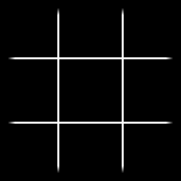
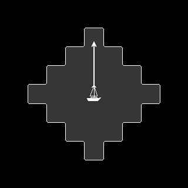
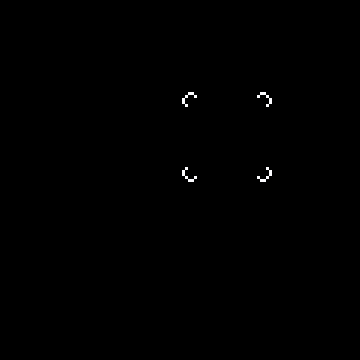

# What am I doing?

After creating [PolarityTD](/projects/polarity-td), I decided to work on a top-down strategy game. Struggling to finish projects without external deadlines, I discovered that dividing the project into bite-sized chunks and tackling them one at a time works best for me. Each game component should be relatively self-contained and reusable. To stay motivated and document my progress, I plan to share updates about this process.

# What has been done already?

Visit the [blog section](/posts/) of my page to read the full write-ups for the components listed below.

## Dual Grid Tilemap

[Tilemap area highlighting using just 6 tiles](/posts/dual-grid-tilemap)

## Path Drawing System

[Drawing a path based on tilemap coordinates](/posts/path-drawing-system)

## Snapping Cursor

[Cursor that snaps to the grid](/posts/snapping-cursor)

# What do I plan to do?

## Turn based battle architecture

- How to organize the scenes for a turn based battle?
- What responsibilities should each scene have?
- How is data transferred between components?

## Unit component

- How fast should the animation be?
- What options might it need?

## Scene management

- Do I need different transition animations?
- Should I allow adjustments to the transition speed?
- How should scenes be managed?

# Check it out!

**See the [GitHub repository](https://github.com/kabaczek1/kaba-game).**
